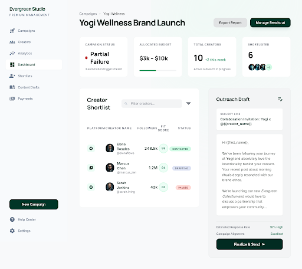

# Alignd: Creator Sponsorship Agent



https://github.com/user-attachments/assets/cd5f567f-03bc-416b-b169-07e346179c97

An **autonomous agent that runs an influencer-sponsorship campaign end to end** —
from "here's my brand and budget" to a shortlist of vetted creators with outreach
emails sent. Built as a **TinyFish accelerator MVP**: you describe a campaign, and
the agent scouts YouTube creators, enriches and scores them, runs brand-safety
checks, finds contact surfaces, and executes outreach — each stage a live web-agent
run, orchestrated and resumable.

---

## Pipeline

A campaign flows through a multi-stage agentic pipeline, coordinated by
`CampaignRunner`, with every web action driven by the **TinyFish Web Agent** and
each step logged as a timeline event:

```
discovery → enrichment → scoring → brand safety → contacts → outreach
```

**▸ Discovery** &nbsp;·&nbsp; `discovery.py`
Searches YouTube for fitness creators who take sponsorships — filtering out
agencies, brands, and media companies.

**▸ Enrichment** &nbsp;·&nbsp; `enrichment.py`
Pulls public channel stats (subscribers, views, engagement signals) from each
creator's channel + About/Links tabs.

**▸ Scoring** &nbsp;·&nbsp; `scoring.py`
Ranks creators against the campaign brief and budget using engagement ratios and
fit.

**▸ Brand safety** &nbsp;·&nbsp; `brand_safety.py`
An LLM checks each creator against a safety threshold — **Gemini by default,
switchable to Anthropic** via env config.

**▸ Contacts** &nbsp;·&nbsp; `contacts.py`
Finds a business email by walking the About tab, Linktree-style link-in-bio pages,
and personal sites.

**▸ Outreach** &nbsp;·&nbsp; `outreach.py`, `email_sender.py`
Drafts and sends a tailored outreach email over **Gmail SMTP** (rate-limited to a
capped number of sends).

State persists in **SQLite**, so incomplete campaigns resume automatically on
restart. The UI is a server-rendered **HTMX dashboard** showing the live run
timeline, creator table, and campaign summaries.

---

## Stack

| Layer | Tech |
|---|---|
| API / backend | **FastAPI** + Uvicorn |
| Frontend | Jinja2 + **HTMX** + Tailwind (CDN) |
| Persistence | **SQLAlchemy** + SQLite |
| Web automation | **TinyFish** Web Agent REST API (async + poll) |
| Brand-safety LLM | Gemini / Anthropic (configurable) |
| Email | Gmail SMTP |

---

## Setup

```bash
git clone https://github.com/PakhiBanchalia/sponsorship-agent.git
cd sponsorship-agent

python3 -m venv .venv && source .venv/bin/activate
pip install -r requirements.txt

cp .env.example .env
```

Then fill in `.env`:

```
TINYFISH_API_KEY=...               # required — drives all web actions
BRAND_SAFETY_LLM_API_KEY=...       # required
BRAND_SAFETY_LLM_PROVIDER=gemini   # or 'anthropic'
GMAIL_FROM_ADDRESS=...             # only if sending real emails
GMAIL_APP_PASSWORD=...
```

Run caps, timeouts, and the brand-safety threshold are all tunable in `.env`.

## Run

```bash
uvicorn app.main:app --reload
```

Open **http://localhost:8000**, create a campaign with a brand name, brief, and
budget, and watch the pipeline execute live.

---

## Notes

→ TinyFish calls are **async + poll**; discovery timeout defaults to 300s because
live search runs often exceed two minutes.
→ Scoped to **YouTube fitness creators** for this MVP.
→ Outreach is capped (default: one send per run) as a safety rail.
→ `streaming_url` from a run is shown as an external link, not embedded.

See `Automated_Sponsorship_Campaign_Management.mp4` and the dashboard screenshots
in the repo for a walkthrough of a full campaign.
